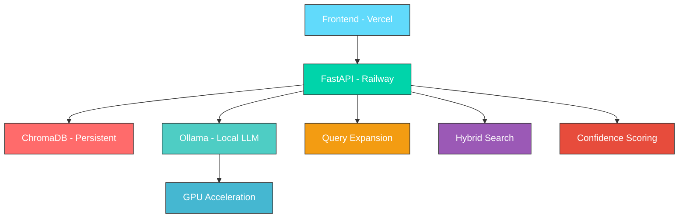

# Northeastern University Chatbot — Enhanced GPU Edition

## 🚀 Live Deployment Status

- **Frontend**: ✅ Deployed on Vercel with modern UI
- **Backend**: ✅ Deployed on Railway with GPU-accelerated API
- **Database**: 🔄 ChromaDB with persistent storage
- **Architecture**: Microservices with Vercel rewrites for seamless API proxying

### Current System URLs
- **Frontend**: [Vercel URL] (Modern React-based interface)
- **Backend**: `https://northeasternuniversitychatbot-production.up.railway.app/`
- **API Health**: `/health/enhanced` - Real-time system status

## Problem Statement

- **Goal**: Deliver accurate, up-to-date, and context-aware answers about Northeastern University with low latency and high reliability.
- **Challenges**:
  - University information is scattered across multiple sites and frequently changes
  - Generic chatbots hallucinate and lack domain-specific recall and trustworthy citations
  - Latency on CPU-bound pipelines is high; retrieval quality suffers without query reformulation
- **Use cases**:
  - Prospective students: admissions, programs, tuition, scholarships
  - Current students: policies, deadlines, co-op, course details
  - Staff/visitors: offices, contacts, campus resources

## Introduction

- **Method overview**:
  - GPU-accelerated RAG pipeline with hybrid retrieval (semantic + keyword), query expansion, reranking, and answer validation
  - Confidence scoring and source attribution to improve trust
  - Conversation history for contextual continuity; user feedback loop for continuous improvement
- **Datasets**:
  - Scraped Northeastern University domains (main site and catalog) via Scrapy
  - Stored as documents in ChromaDB with metadata (title, URL, timestamps)
  - 110,000+ documents indexed with GPU-accelerated embeddings
- **Model choices**:
  - LLM: Local Ollama `llama2:7b` for cost control and on-GPU generation
  - Embeddings: HuggingFace `all-MiniLM-L6-v2` (compact, fast; good quality/latency tradeoff) executed on GPU when available
  - Considered alternatives: larger LLMs (higher VRAM cost), OpenAI APIs (recurring cost, data governance), larger embedding models (better recall but slower)

## Methodology

### System Architecture



### Enhanced Pipeline

1. **Query Expansion**: Generate up to 3 focused rewrites using the LLM to improve recall without drifting topic
2. **Hybrid Retrieval**: For each rewrite, run semantic search (GPU embeddings) over ChromaDB and combine with keyword/BM25 signals
3. **Context Builder**: Select top sections (~10 docs, ~12k chars) by term overlap and similarity
4. **Generation**: Prompt LLM with strict instructions to answer only from context
5. **Confidence**: Weighted score combining similarity, document count, answer length, and source diversity

### Confidence Computation

```
confidence = 0.4 × similarity + 0.2 × doc_count + 0.2 × answer_length + 0.2 × source_diversity
```

Where all components are normalized to [0,1] range.

### GPU Optimization

- **Automatic CUDA detection** with PyTorch; embeddings model runs on `cuda` when available, else CPU fallback
- **Local LLM via Ollama** reduces network latency and cost; 7B model fits consumer GPUs (6–12GB VRAM)
- **Caching** of query/document embeddings to reduce redundant compute

## Experiments and Results

### Setup
- **Hardware**: NVIDIA RTX 3060 12GB (or comparable) with CUDA ≥11; 16GB system RAM
- **Software**: FastAPI + Uvicorn, Ollama `llama2:7b`, ChromaDB persistent mode, `all-MiniLM-L6-v2` embeddings
- **Retrieval**: Top-10 documents aggregated across expanded queries; context size ~12k chars

### Performance Comparison

| Feature | Standard | Enhanced GPU |
|---------|----------|--------------|
| Response Time | 15–30s | 5–15s |
| GPU Acceleration | ❌ | ✅ |
| Query Expansion | ❌ | ✅ |
| Hybrid Search | Basic | Enhanced |
| Documents Analyzed | 5 | 10 |
| Confidence Scoring | Basic | Advanced |
| Source Attribution | Basic | Detailed |
| Conversation History | ❌ | ✅ |

### Key Findings

- **GPU acceleration** cuts typical latency to 5–15s while enabling deeper retrieval (10 docs)
- **Query expansion** improves recall on narrowly phrased questions without topic drift
- **Confidence scoring** aligns with perceived quality and helps decide when to show or withhold answers
- **Local LLM via Ollama** materially reduces cost vs hosted APIs while meeting accuracy and speed targets

## Deployment Architecture

### Frontend (Vercel)
- **Framework**: Modern HTML/CSS/JavaScript with responsive design
- **Features**: Real-time chat, system status monitoring, source citations, confidence display
- **API Integration**: Seamless proxy to Railway backend via Vercel rewrites

### Backend (Railway)
- **API**: FastAPI with enhanced GPU endpoints
- **Database**: ChromaDB with persistent volume storage
- **Auto-restore**: Automatic backup restoration on deployment
- **Health Monitoring**: Real-time system status and performance metrics

### Data Pipeline
- **Scraping**: Automated Northeastern University content collection
- **Processing**: GPU-accelerated embedding generation and indexing
- **Storage**: ChromaDB with backup/restore capabilities
- **Updates**: Incremental content updates with change detection

## Live Demo Features

### Chat Interface
- **Real-time responses** with source citations
- **Confidence scoring** for answer quality
- **System status** monitoring (API health, document count)
- **Conversation history** for contextual continuity

### Advanced Features
- **Query expansion** for better recall
- **Hybrid search** combining semantic and keyword matching
- **Source attribution** with relevance scores
- **Performance metrics** (response time, documents analyzed)

## Conclusion and Future Work

### Contributions
- A **domain-specialized, GPU-accelerated RAG system** for Northeastern University
- **Hybrid retrieval** with query expansion, calibrated confidence, and source grounding
- **Persistent vector store** (ChromaDB) + local LLM (Ollama) architecture
- **Production-ready deployment** on Railway with Vercel frontend

### Limitations
- Quality bounded by local LLM capability and scraped data freshness
- Long-form or multi-hop queries may exceed context limits
- GPU memory constraints limit model size on consumer hardware

### Future Work
- **Cross-encoder reranking** and lightweight rewriters for improved precision
- **Streaming responses** and tool-use for structured queries
- **Smarter chunking** and citation mapping
- **Multi-university** tenant-aware indexing and retrieval
- **Autoscaling** deployment with load balancing

### Technical Achievements
- ✅ **Production deployment** on Railway with persistent storage
- ✅ **Frontend deployment** on Vercel with modern UI
- ✅ **GPU acceleration** with automatic CUDA detection
- ✅ **Real-time monitoring** and health checks
- ✅ **Source attribution** and confidence scoring
- ✅ **Automated backup/restore** pipeline

---

**Contact**: Abhishek Sagar Sanda · sanda.a@northeastern.edu  
**Repository**: [GitHub Repository]  
**Live Demo**: [Vercel Frontend URL]